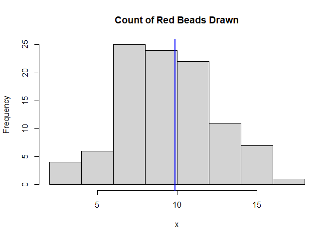

XMR Simulation
================
John Rollman
June 17, 2021

-   [Packages](#packages)
-   [XMR Chart Demo](#xmr-chart-demo)
    -   [Simulated Red Bead Experiment: Demonstrating Process Behavior Charts](#simulated-red-bead-experiment-demonstrating-process-behavior-charts)

Packages
========

``` r
library(tidyverse)
```

XMR Chart Demo
==============

Simulated Red Bead Experiment: Demonstrating Process Behavior Charts
--------------------------------------------------------------------

Lets say I have a bowl with white and red beads. For arguments sake, there are 900 white beads and 100 red beads. If I, blindfolded, reach in with my hand and grab a single bead, the chance of picking a red bead is 10% (100/1000).

``` r
#Set the probability of picking a red bead
p_red <- .1
```

Now suppose I pick out 100 beads at random and count the number of red beads and repeat this 100 different times (returning the beads to the bowl each time). I would expect, on average, to get around 5 read beads every handful. We can simulate this scenario since this process of drawing N handfuls of n beads is well modeled by the Binomial distribution.

``` r
#How many handfuls of beads we plan on taking
N <- 100

#How many beads will be in each handful
n <- 100

#Create an empty vector to hold opur simulated values
#z <- rep(0,1000)

#100 binomial samples of size 100
x <- rbinom(N,n,prob = p_red)

#Plot histogram of the results of our simulation
hist(x, freq = T, main = 'Count of Red Beads Drawn')
abline(v=mean(x),col="blue",lwd=2)
```



``` r
#We could theoretically do this for 10000 samples for a better visual of how the process works
x <- rbinom(10000,100,prob = p_red)
hist(x, freq = T, main = 'Count of Red Beads Drawn')
abline(v=mean(x),col="blue",lwd=2)
```


If you notice from the histogram, the resulting shape looks like a typical 'Normal'/'Bell-Shaped' distribution, this is because the binomial distribution can be well approximated by the normal distribution when the sample size is large. This is usually taught as n\*p &gt; 5.

Now that we have a good idea of what our 'Population' looks like. Lets apply a process behavior chart to this population, where every drawn handful represents one month of data. We'll simulate 2 years of data, so 24 months

``` r
#Generate data
dat <- data.frame(mnth = 1:24, 
             r_cnt = rbinom(24,100,prob = p_red),
             denom = rep(100,24),
             DataType = "Baseline"
             )

dat$pct <- dat$r_cnt/dat$denom
mr <- abs(diff(dat$pct))

hist(dat$r_cnt, freq = T, main = 'Count of Red Beads Drawn')
```


``` r
hist(dat$pct, freq = T, main = 'Count of Red Beads Drawn')
```


This is looks less like the "bell curve" but we still know its population distribution is well modeled by a normal distribution.

``` r
#Create Centerline (Harmonic Mean)
CL <- sum(dat$r_cnt)/sum(dat$denom)

#Create Upper and lower Limits
UCL <- CL + 3*(mean(mr)/1.128) #the average moving range divided by the unbiasing factor estimates SD
LCL <- max(CL - 3*(mean(mr)/1.128),0)

### Make the plot
XmR_Plot <- 
  ggplot(dat, aes(x = mnth, y = pct)) + 
  geom_point() + geom_line() + # add the data points
  geom_hline(yintercept = CL, linetype = 3) + #add the centerline (harmonic mean)
  geom_hline(yintercept = UCL) + #Add the upper and lower control limits
  geom_hline(yintercept = LCL) +
  scale_x_continuous(expand =  expansion(mult = .15))  # Pad the x-axis
 
### Draw the plot - Done
XmR_Plot
```


Now lets say the probability changes

``` r
#Generate NEW data
dat_n <- data.frame(mnth = 25:36, 
             r_cnt = rbinom(12,100,prob = .15),
             denom = rep(100,12),
             DataType = "New_Data"
             )

dat_n$pct <- dat_n$r_cnt/dat_n$denom

dat_all <- rbind(dat,dat_n)

### Make the plot
XmR_Plot <- 
  ggplot(dat_all, aes(x = mnth, y = pct)) + 
  geom_point() + geom_line() + # add the data points
  geom_hline(yintercept = CL, linetype = 3) + #add the centerline (harmonic mean)
  geom_hline(yintercept = UCL) + #Add the upper and lower control limits
  geom_hline(yintercept = LCL) +
  scale_x_continuous(expand =  expansion(mult = .15))  # Pad the x-axis
 
### Draw the plot - Done
XmR_Plot
```


You can see it also works for proportion! Many people who have taken a Lean or Six Sigma course would probably direct you to a flow chart and tell you that we need to use a P-Chart for proportional data. Lets try a P-Chart!

``` r
### Make the plot
#WIP
```

``` r
z <- rep(NA,1000)

for (j in 1:1000){

  x <- rpois(12, 10)

  y <- rep(0,20)

  for (i in 1:20) {

    y[i] <- abs(x[i+1]-x[i])

  }

  z[j] <- mean(y, na.rm = T)/1.128

}

hist(z)
```


``` r
mean(z)^2
```

    ## [1] 10.27221

``` r
bias <- rep(NA,100)

se <- rep(NA,100)

for (k in  2:100) {

  z <- rep(NA,1000)

  for (j in 1:1000){

    x <- rnorm(k, 2, 2)

    y <- rep(0,20)

    for (i in 1:20) {

      y[i] <- abs(x[i+1]-x[i])

    }

    z[j] <- mean(y, na.rm = T)/1.128

  }

  bias[k] <- mean(2-z)

  se[k] <- sd(z)

}

mse <- bias^2 +se^2

plot(1:100,bias, ylim = c(-1,1))
```


``` r
plot(1:100,se)
```


``` r
plot(1:100,mse)
```


``` r
bias <- rep(NA,100)

se <- rep(NA,100)

for (k in  2:100) {

  z <- rep(NA,1000)

  for (j in 1:1000){

    x <- rpois(k, 2)

    y <- rep(0,20)

    for (i in 1:20) {

      y[i] <- abs(x[i+1]-x[i])

    }

    z[j] <- mean(y, na.rm = T)/1.128

  }

  bias[k] <- mean(2-(z^2))

  se[k] <- sd(z)

}

mse <- bias^2 +se^2

plot(1:100,bias)
```


``` r
plot(1:100,se)
```


``` r
plot(1:100,mse)
```


